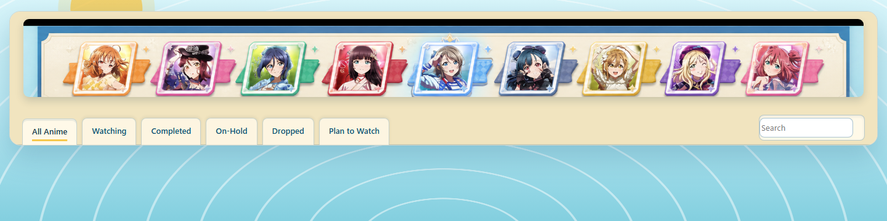
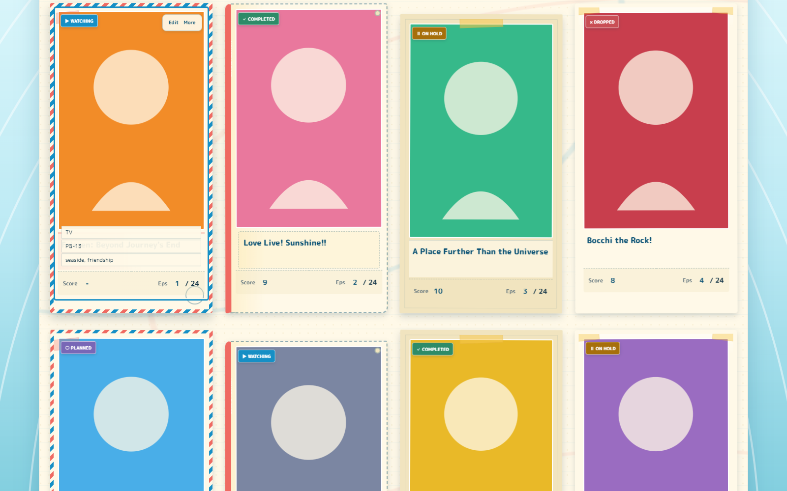
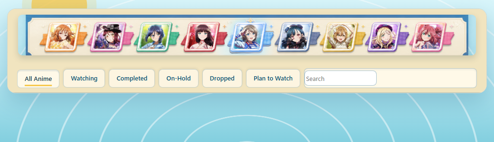

# Aqours Seaside Memory Voyage

A showcase-first custom CSS theme for the **Modern MyAnimeList anime-list
template**, designed for [`jmdspeedy`](https://myanimelist.net/animelist/jmdspeedy).

The theme turns the list into an Aqours seaside travel journal: nine-member
official artwork, tactile photo cards, four rotating scrapbook treatments,
coastal stationery controls, and responsive 4/3/2/1-column layouts.

[Live GitHub Pages preview](https://jmdspeedy.github.io/MyAnimeListCustom/) ·
[Open the stylesheet](aqours-journal.css) ·
[View the anime list](https://myanimelist.net/animelist/jmdspeedy)

## See it in action

These captures show the theme in the real Modern MyAnimeList layout and in the
project's visual test fixture. The header keeps the native navigation and
search controls visible; the card view shows the equal-weight scrapbook
treatments used throughout the list.

  
   
  Desktop header: the nine-member masthead, status tabs, and search remain part of the working MAL interface.

 

  
   
  Card treatments: polaroid, postcard, ticket pocket, and taped photo framing repeat without changing entry priority.

  
Show the compact breakpoint preview

   

  

    
     
    The 1040px layout keeps the controls readable while reducing the masthead footprint.
  

## What it changes

- A nine-member illustrated masthead gives the list a recognizable seaside
  identity without promoting one anime above the others.
- Equal-size entries rotate through four paper treatments for visual rhythm.
- Cover, title, score, progress, status, native MAL links, and owner controls
  remain usable.
- Responsive breakpoints move from four columns to one, with hover metadata
  also available through keyboard focus on capable layouts.
- Hosted artwork and self-hosted fonts have versioned filenames and graceful
  CSS fallbacks.

## Install

1. Open [MyAnimeList's Modern theme editor](https://myanimelist.net/ownlist/style/theme/1).
2. Enable at least **Image**, **Title**, **Score**, **Type**, and
   **Episodes/Progress**. Tags, Rated, dates, studios, notes, and other
   optional Modern columns are supported.
3. Replace the existing custom CSS with the complete contents of
   [`aqours-journal.css`](aqours-journal.css), then save.
4. Check both the public list and the signed-in owner view.

Do not append this stylesheet to the previous theme. It is a complete
replacement.

## Project map

| Path | Purpose |
| --- | --- |
| [`aqours-journal.css`](aqours-journal.css) | Paste-ready production stylesheet. |
| [`index.html`](index.html) | GitHub Pages showcase and asset-host landing page. |
| [`design.md`](design.md) | Source-of-truth visual, responsive, interaction, accessibility, asset, and performance specification. |
| [`assets/images/`](assets/images/) | Optimized Aqours artwork and versioned interface showcase captures. |
| [`assets/fonts/`](assets/fonts/) | Self-hosted webfont subsets and license files. |
| [`assets/ATTRIBUTION.md`](assets/ATTRIBUTION.md) | Artwork provenance and usage notes. |

## Implementation notes

- Four equal-weight card treatments repeat through the list: polaroid,
  postcard, memory ticket, and taped photo mount. There is no arbitrary
  featured anime.
- The layout targets four columns at wide desktop sizes, three on typical
  desktops/laptops, two on compact screens, and one on narrow screens.
- Cover, title, score, and progress remain visible. Secondary metadata is
  revealed by hover and keyboard focus on capable layouts.
- The native MAL title link covers each card's safe click area while owner,
  score, progress, streaming, and detail controls remain independently usable.
- All custom imagery has a CSS-generated coastal fallback. The list stays
  functional if GitHub Pages or optional artwork is unavailable.
- Functional typography uses M PLUS Rounded 1c; Klee One is reserved for
  journal-style headings and captions.

## Rights

The original CSS and documentation are MIT licensed. Aqours artwork remains
the property of its respective rights holders and is not relicensed by this
repository. See [`assets/ATTRIBUTION.md`](assets/ATTRIBUTION.md) before reusing
the artwork files. Bundled fonts retain their own SIL Open Font License texts.
